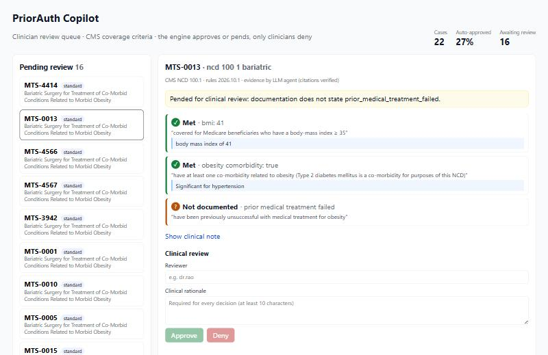

# PriorAuth Copilot

Rules-plus-AI prior authorization on **real CMS coverage policies** and **real clinical notes**. A deterministic criteria
engine makes the coverage decision; an LLM agent finds the evidence in the note and must quote it verbatim; anything that
is not proven is pended for a clinician with the reason. **The system never auto-denies.**



## Real data
- **Policies:** CMS National Coverage Determinations, pulled from the public [CMS Coverage API](https://api.coverage.cms.gov/docs/swagger/index.html):
  **NCD 100.1 Bariatric Surgery** (v5) and **NCD 240.4 CPAP for Obstructive Sleep Apnea** (v3). Each criterion in
  [`priorauth/policies/`](priorauth/policies) quotes the NCD sentence it implements.
- **Clinical notes:** 22 real, de-identified notes from [MTSamples](https://huggingface.co/datasets/harishnair04/mtsamples)
  (bariatric consults and operative notes, sleep studies, pulmonary and sleep follow-ups).
- **Gold labels:** I labelled every note by hand against the NCD criteria ([`data/labels.json`](data/labels.json), with a
  reason per case). They are not clinician-verified.

## Review agent (`priorauth/agent.py`)
`POST /cases/agent` takes only the requested service (with its CPT/HCPCS code) and the notes. The agent:
routes to the policy by billing code -> extracts evidence with keywords -> evaluates -> runs the LLM extractor only if
keywords could not support an approval -> requests exactly the missing documentation -> briefs a clinician -> finishes.
Planner: a rules playbook, or an LLM with function calling (`planner: "llm"`). Code tracks what is still outstanding
and guards block everything else: unknown or wrong policy for the billing code, a second run of the same extractor,
requests for facts that are not missing, finishing with anything but the engine's outcome. It cannot deny.

| Agent on the 22 real cases | Routed | Correct decisions | False approvals | LLM extractions |
|---|---|---|---|---|
| Keyword extractor only (CI gate, offline) | 22/22 | 20/22 | 0 | 0 |
| Keywords, then LLM only when needed | 22/22 | **22/22** | **0** | 18 |

## Results on the 22 real cases

| Evidence extractor | Decisions correct | False approvals | Eligible cases approved | Facts correct |
|---|---|---|---|---|
| Keyword rules (deterministic baseline) | 20/22 (91%) | 0 | 4/6 | 83% |
| **LLM agent + citation check + self-repair** | **22/22 (100%)** | **0** | **6/6** | **89%** |

Only 6 of 22 real notes document every criterion Medicare requires, which is why most cases pend: 12 for missing
documentation and 4 for criteria not met. That is the real-world problem prior authorization automation has to handle.

**What real notes do to naive extraction:**
- A polysomnogram reports "AHI 4.7" in the supine position and **overall AHI 1.3**; a keyword rule takes 4.7.
- A CPAP titration study reports AHI 2.7 **measured on CPAP**, not the diagnostic value.
- "Respiratory disturbance index 9.9" in one report is really the **arousal index** (the AHI is 76).
- One note transcribes AHI as "**age index** 12.3"; the keyword rule misses it, the agent reads it correctly.
- Education text ("patients with this condition are susceptible to excessive daytime sleepiness ... stroke") is not a
  diagnosis, but both extractors can be fooled; the rules still pend unless every criterion is proven.

**How the agent is kept honest:** every value must come with a verbatim quote. Quotes are checked against the note
(letters and digits only, so transcription punctuation does not matter; `...` is allowed only when every fragment
appears in order), and numbers must appear inside their own quote. A value that fails is discarded, and the agent gets
one chance to repair the citation; 4 citations were repaired this way and 1 paraphrase was correctly rejected.

## API testing with Postman (`postman/`, `docs/test_cases.md`)
21 API test cases (12 edge cases) written once in `postman/build.py`, which generates both a **Postman collection**
and a readable [test-case document](docs/test_cases.md). The collection runs in order against the demo API, reusing
ids from earlier steps (submit, read back, clinician deny, re-review conflict), and checks validation (422), unknown
ids (404), state conflicts (409), the request-id header and the stats. CI runs it with **Newman** against the Docker
container on every push. The suite found one real bug: a typo in the queue filter (`?status=pending`) returned an
empty clinician queue instead of an error; it now returns 422.

    npx newman run postman/priorauth.postman_collection.json --env-var baseUrl=http://localhost:8920

## How it works

```
POST /cases ─> store note in MongoDB (FHIR DocumentReference) + original in AWS S3 (SSE, presigned links)
           ─> case row in PostgreSQL / MySQL (status, urgency, received_at)
           ─> evidence agent (LLM, verified quotes)  ── fallback ─> keyword extractor
           ─> criteria engine (versioned NCD rules, three-valued logic: met / not met / not documented)
           ─> approve  |  pend with reason + missing facts  ─> clinician queue (React console) ─> approve / deny + rationale
every step ─> append-only audit trail
```

| Layer | Technology |
|---|---|
| API | Python, FastAPI, pydantic validation, structured request logs with request IDs |
| Rules engine | Versioned JSON policies, three-valued logic, rule tree validated on load |
| AI | LLM evidence agent (OpenAI-compatible API; gpt-oss-120b on Groq), citation verification, self-repair, keyword fallback |
| Relational | SQLAlchemy Core on **PostgreSQL** and **MySQL** (SQLite locally): cases, decisions, audit; index on (status, received_at) for the queue |
| NoSQL | **MongoDB**: clinical documents as FHIR-style DocumentReference resources, indexed by case |
| Cloud | **AWS S3**: original documents, server-side encryption, short-lived presigned URLs |
| Frontend | **React + TypeScript** (Vite): review queue, criteria checklist with quotes, decision form with required rationale |
| Tests | 31 pytest tests (rules, citation checks, stores, API) run on SQLite, PostgreSQL and MySQL; 3 Vitest + Testing Library tests |
| CI/CD | GitHub Actions: PostgreSQL, MySQL and MongoDB service containers, an evaluation gate that fails on any false approval, frontend build, Docker image smoke test |

## Run

```bash
pip install -r requirements.txt
python -m pytest                          # 31 tests (add PRIORAUTH_TEST_PG_URL / _MYSQL_URL / _MONGO_URI for real DBs)
python -m evals.run_eval                  # keyword + LLM (set GROQ_API_KEY) on the 22 real cases
python scripts/demo_api.py                # API on :8920 with the real cases loaded
cd web && npm install && npm run dev      # console on :5175
docker compose up                         # API + PostgreSQL + MongoDB
```
To rebuild the cases, download `mtsamples.csv` into `data/raw/` and run `python -m priorauth.cases`.

## Limits
- 22 cases is a small evaluation; each case is about 4.5 points. It shows the method, not production accuracy.
- Labels are mine, not a clinician's. Two policies only; the NCD text is real but real payers add their own criteria.
- MTSamples notes were not written for prior authorization, so they often lack elements a real submission would include.
- Not medical advice and not a coverage determination tool.

## License
The code is open source under the [MIT License](LICENSE). Clinical notes come from MTSamples (Apache-2.0); CMS coverage policies are US government works.
